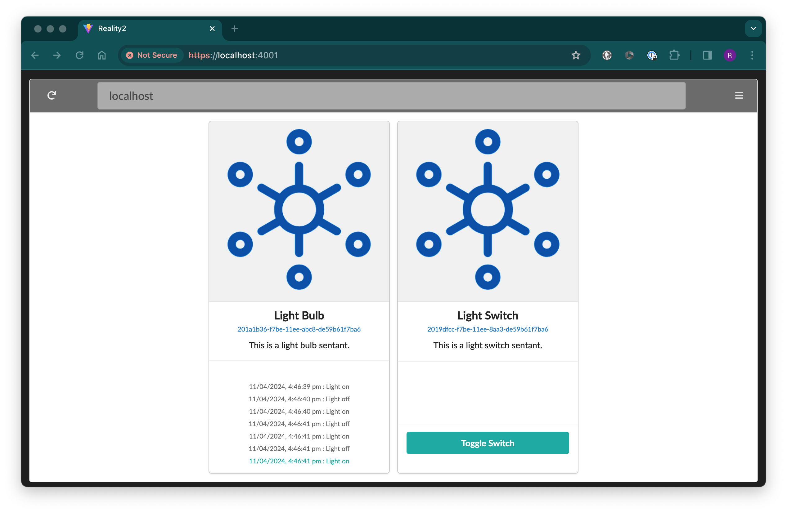
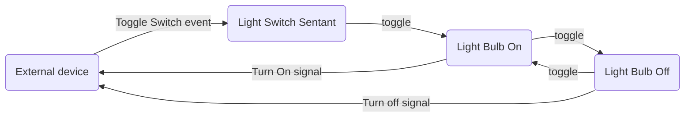

# Testing

At this point, you are feeling jubilant because you have compiled and run a Reality Node.  Congratulations, you are obviously a Linux guru and can get other people to buy you pizza and coffee.

Now let's add some Sentants.

Inside the main folder, there is a folder called 'python' which, perhaps not surprisingly, contains some python code that sets up some Sentants.  You can also find examples of YAML and JSON files with Sentant and Swarm definitions.

Start yourself a new terminal, leaving the other one you used to start the Reality2 node running, and type the following (I'm assuming you have python3 installed - most linux distributions do):

```bash
cd demos/python
python3 simple_light_and_switch.py
```

This probably won't work because there are some libraries to install first, most notably:

```bash
pip3 install gql
pip3 install requests
pip3 install requests_toolbelt
pip3 install websockets
```

After doing that, try running the code again, and you should see something like this:

````
+---- Light Switch and Bulb ------------------------------+
| Press the enter key to toggle the light switch.         |
| Press q, followed by the enter key to quit.             |
+---------------------------------------------------------+
Joined: wss://localhost:4001/reality2/websocket
Joined: wss://localhost:4001/reality2/websocket
Subscribed to 201a1b36-f7be-11ee-abc8-de59b61f7ba6|Light off
Subscribed to 201a1b36-f7be-11ee-abc8-de59b61f7ba6|Light on
````

And the webpage should have updated itself to look like this:



If you press the 'Toggle Switch' button a few times, you'll see 'Light on' and 'Light off' messages appear on the 'Light Bulb' Sentant.


And the terminal should show output like this:

````
The light is on.
The light is off.
The light is on.
The light is off.
The light is on.
The light is off.
The light is on.
````

This illustrates the Interactivity and Consistency aspects of Sentants.  You are seeing the same state and output in two different views.

You can also press the enter key in the terminal to toggle on and off the switch, and see the messages update in the web view as well.

The Automations for the two Sentants look like this:




When you are happy this is all working, press 'q' in the terminal to quit the python code.

You will note, though, that the web view is still showing two Sentants.  This illustrates the Persistant nature of Sentants, ie they exist until you remove them.  The python program created them, but didn't remove them again.  So, you can still press the 'Toggle Switch' button on the Light Switch, and it still works.