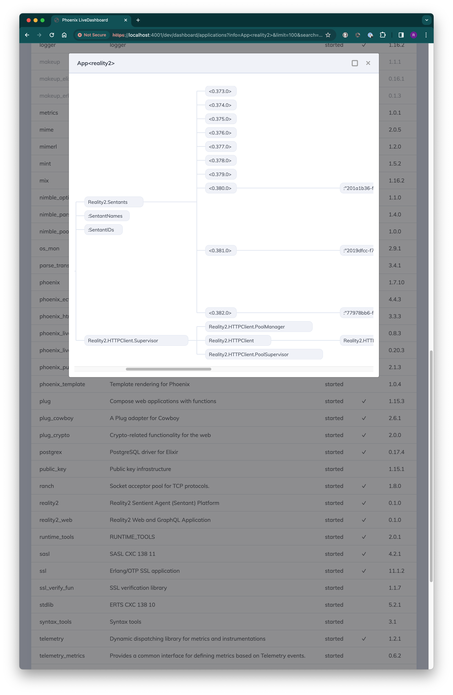

# The Dashboard

Elixir, or more specifically, the BEAM engine running the Phoenix Framework, has a nifty visualiser for understanding what is going on during the development phase.

in your browser, go to `https://localhost:4005/dev/dashboard`

You can see some of the Reality2 Node Applications running:

What you are seeing is the multitude of parallel processes that the Reality2 node runs in order to create the Sentants.  Each Sentant is composed of many parallel-running processes, all intercommunicating to produce the output and interactivity experienced.

For more information about this, have a look at the [Elixir](https://elixir-lang.org/) documentation.