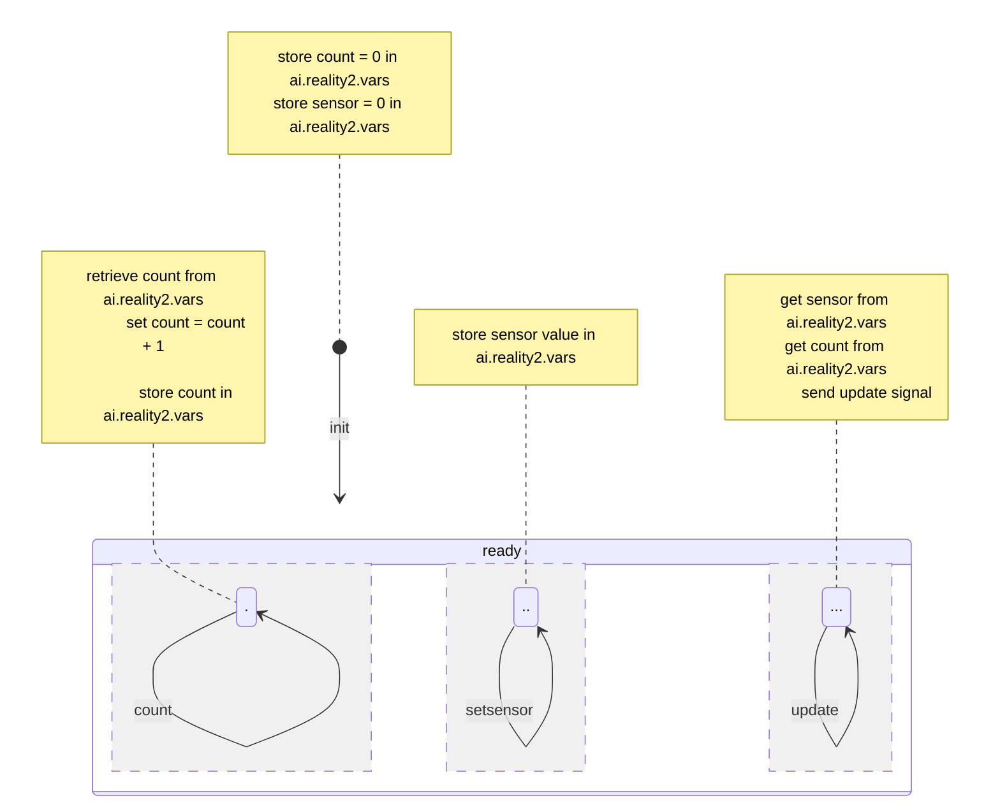

# IoT Demo

## Introduction

We wanted to create an example at the University for students in a lecture theatre, to help them understand IoT devices and for each to be able to interact with a shared experience during lecture, all at once, that involved hardware and software.

This WebApp is included in the main branch, and will become part of the next release.

## User story

1. As each student enters the lecture hall, they scan a QR code with the mobile phone to link to a WebApp.
2. Each device appears on the lecture room projector screen, attached to some part of a simulation or Digital Twin.
3. The sensors on the phone are used to change parameters of the simulation, with the students having to interact in specific ways to achieve a result (for example, rotate the phone yaw until it reaches 90 degrees, and tap the 'count' button 20 times).


## WebApp pages

To achieve the desired result, there are several parts to the WebApp

1. The WebApp **Landing page**: `/iotdemo`This has the QR code(s) for the students to scan to enter their devices.
2. The **Connection page** that the QR code leads to: `/iotdemo?connect` which has some interaction to approve the enrolement of the phone.
3. The **Sensor page** that reads the phone's sensors and passes that information to the Reality2 Node: `/iotdemo?id=[sentant ID]`
4. The **View page** that shows all the devices together `/iotdemo?view`

### Setting up

This is WebApp is included, but if you were wanting to set it up from scratch, you would first follow the instructions for [adding a new WebApp](../10%20Adding%20a%20WebApp/New.md), and call this one 'iotdemo', add the required code in the lib folder (mostly svelte pages) and modift the App.svelte, as well as perhaps some of the css files.

##### reality2.ts

If create a new WebApp, inside the `lib` folder, make sure you have a copy of the `reality2.ts` file (grab this from the `web/iotdemo` or `web/sentants` folder).  This contains the SDK for the Reality2 GraphQL API.  You don't have to use this as you can make your own, or you can tweak it for your own requirements.

### App.svelte

The main page for any WebApp set up using Svellte and Vite, is a page called 'App.svelte' in the main directory.  Within that file, there is a section that defines how the webpage is structured.  In this example, we have used a library called `svelte-fomantic-ui` which can be found [here](https://github.com/roycdaviesuoa/svelte-fomantic-ui), also created by the main developer of Reality2.

Given that it is essentially impossible to connect IoT devices to the university WiFi, we opted to have our own router in the lecture theatre, but that necessitates that each student has to join that WiFi network first.  Luckily, this can be also be achieved using a QR code.


The part of App.svelte that achieves this is:

```svelte
<Cards ui centered>
    <Card ui centered>
        <Message ui blue large>
            <Header>
                Scan this QR code to join the IoT network.
            </Header>
        </Message>
        <Content>
            <Link ui href={"https://"+ window.location.hostname + ":" + window.location.port + "/iotdemo?connect"}>
                <QrCode value={network_qr} size={250} fluid/>
            </Link>
        </Content>
        <Input ui labeled fluid massive>
            <Input text massive placeholder={"SSID"} bind:value={set_ssid}/>
        </Input>
        <Input ui labeled fluid massive>
            <Input text massive placeholder={"PASS"} bind:value={set_pass} centered/>
        </Input>
    </Card>
    <Card ui centered>
        <Message ui blue large>
            <Header>
                Scan this QR code to connect your device.
            </Header>
        </Message>
        <Content>
            <Link ui href={"https://"+ ip_addr + ":" + window.location.port + "/iotdemo?connect"}>
                <QrCode size={250} value={"https://"+ ip_addr + ":" + window.location.port + "/iotdemo?connect"} isResponsive/>
            </Link>
        </Content>
        <Input ui labeled fluid massive>
            <Input text massive placeholder={"IP ADDR"} bind:value={set_ip_addr}/>
        </Input>
        <Button ui massive fluid blue on:click={showView}>
            Main View
        </Button>
    </Card>
</Cards>
```

Once the QR Codes have been scanned, the student, on their phones will see this (left image), and when they click connect, the image on the right.


| connect | sensor |
| :-----: | ------ |
|  |  |

The code for the phones that reads the sensors and sends this to the Reality2 node is in the file `SensorCard.svelte` whilst the code for viewing all the devices (phones) on the projector is in `SentantCard.svelte`.

When the student presses the `connect` button, a new Sentant is created from a pattern (see below), and the page on their device is changed to show that Sentant.

```javascript
    // -------------------------------------------------------------------------------------------------
    // Connect a new device
    // -------------------------------------------------------------------------------------------------
    function newDevice() {

        // Get all the existing Sentants so we can count them to add a new one
        r2_node.sentantAll()
        .then((data) => {
            // Find out how many Sentants there are
            var counter = 0;
            var sentants: [] = R2.JSONPath(data, "data.sentantAll");
            sentants.forEach((sentant) => {
                if ((R2.JSONPath(sentant, "name") !== ".deleted") && (R2.JSONPath(sentant, "name") != "monitor"))
                {
                    counter = counter + 1;
                }
            });

            // Set the new one to be one more in the sequence
            var newName = "device " + String(counter+1).padStart(4, '0');

            // Set the new name by replacing the '__name__' in the text version of the json definition
            var sentantDefinition = JSON.stringify(template).replace("__name__", newName);

            // Load Sentant definition to the Reality2 node
            r2_node.sentantLoad(sentantDefinition)
            .then((data) => {
                // Get the ID of the new Sentant
                var sentantID = R2.JSONPath(data, "data.sentantLoad.id");

                // Change the page to view that new Sentant
                window.location.href = "https://"+ window.location.hostname + ":" + window.location.port + "/iotdemo?id=" + sentantID;
            })
            .catch((_error) => {
                set_state = "error";
                loadedData = [];
            })
        })
        .catch((_error) => {
            set_state = "error";
            loadedData = []
        })
    }
    // -------------------------------------------------------------------------------------------------

```

### Sentant Definition

The sentant definition is included in `App.svelte` and is as follows:

```json
{
    "sentant": {
        "name": "__name__",
        "automations": [
            {
                "name": "counter",
                "transitions": [
                    {
                        "event": "init",
                        "actions": [
                            { "command": "set", "plugin": "ai.reality2.vars", "parameters": { "key": "counter", "value": 0 } },
                            { "command": "set", "plugin": "ai.reality2.vars", "parameters": { "key": "sensor", "value": 0 } }
                        ]
                    },
                    {
                        "event": "setsensor", "public": true, "parameters": { "sensor": "integer" },
                        "actions": [
                            { "command": "set", "plugin": "ai.reality2.vars", "parameters": { "key": "sensor", "value": "__sensor__" } }
                        ]
                    },
                    {
                        "event": "count", "public": true,
                        "actions": [
                            { "command": "get", "plugin": "ai.reality2.vars", "parameters": { "key": "counter" } },
                            { "command": "set", "parameters": { "key": "counter", "value": { "expr": "counter 1 +"  } } },
                            { "command": "set", "plugin": "ai.reality2.vars", "parameters": { "key": "counter", "value": "__counter__"  } }
                        ]
                    },
                    {
                        "event": "update", "public": true,
                        "actions": [
                            { "command": "get", "plugin": "ai.reality2.vars", "parameters": { "key": "counter" } },
                            { "command": "get", "plugin": "ai.reality2.vars", "parameters": { "key": "sensor" } },
                            { "command": "signal", "public": true, "parameters": { "event": "update" } }
                        ]
                    }
                ]
            }
        ]
    }
}
```

Key points to note are that the way the counter and sensor values are saved to disk in between sentant events.  This is necessary as Sentants themselves are immutable, so each time a new set of actions is initiated through an event transition, there is no memory of previous events or values, aside from the current state.  Note however, that here we are using the abbreviated form of the finite state machine definition where we ignore the states, so the `in` and `out` states are not defined.



### Events and Signals

Once the student's devices have connected, the data flow is as follows.

1. Each device reads the movement sensors, and has a button `count` on the screen for interaction.
2. When the device is moved, or when the `count` button is pressed, an event is sent to the Sentant, either `count` or `setsensor`.
3. To tell the devices connected (the student's phone and the main viewing app on the projector) to update the view, an `update` event is also sent after each `count` or `setsensor` event which sends the current stored values as the `update` signal.

The `update` signal has been set up when the page loads:

```javascript
    let set_counter = 0;
    let set_sensor = 0;

    // Dynamic values
    $: counter = set_counter;
    $: sensor = set_sensor;

    onMount(() => {
        // Ignore deleted Sentants, and the monitor Sentant
        if ((sentant.name == "monitor" || sentant.name == ".deleted")) return;

        // Await the update signal
        r2_node.awaitSignal(sentant.id, "update", (data: any) => {
            if(R2.JSONPath(data, "status") == "connected")
            {
                // When first connected, send an update event to get the current values
                r2_node.sentantSend(sentant.id, "update", {});
            }
            else
            {
                // Update the values and initiate a redraw
                set_counter = Math.floor(data.parameters.counter);
                set_sensor = Math.floor(data.parameters.sensor);
            }
        });
    });
```

### View

The projector view, showing 10 devices, might look as follows.  Each view of each device is being udpated by its Sentant, which is receiving data from a student's phone.  Here, we are just showing a simple view - however, this can be as complicated and intricate as you desire, for example, it might show a 3D view of a digital twin representing some physical object (eg a factory), or an interesting artistic graphic.

