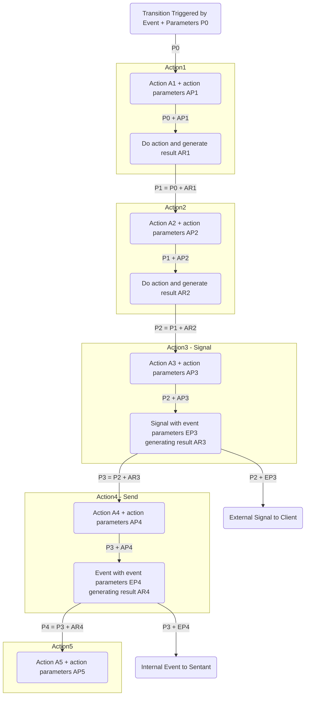

# Actions

There are many actions (sometimes called side-effects in Finite State Machine documentation) that can be called when a transition triggers.  Some are inbuilt, and some come from the plugins.  All actions have two parts, the `command` and the `parameters` for the command.  If this is a `send` command to a plugin, then there is also a `plugin` field.

#### send

Send an event to a Sentant.

- **to** - (optional) the name of the Sentant to send the event to.  Presently, only to Sentants on this Reality2 node, but later, will be able to use a Path.  If no to field is given, then the event is sent to this Sentant.
- **event** - the event to send.
- **parameters** - (optional) - some other data to send along with the event.
- **delay** - (optional) - a delay in milliseconds.  If omitted, the event is sent immediately.

```YAML
actions:
  - command: send
    parameters: 
      to: Another Sentant
      event: an event
      parameters: 
        param1: true
        param2: a String
        param3: 42
      delay: 5000
```

#### send

Send to an external plugin.

- **plugin** - the name of the plugin
- **parameters** (optional) - some other data to send to the plugin

```yaml
actions:
  - command: send
    plugin: com.openai.api
    parameters:
      question: What is the square root of pi?
```

#### plugin

The plugin parameter is also used to interact with internal plugins, with the command and parameters determined by that plugin.  For example, to use the capabilities of the geospatial plugin with a Sentant:

```json
{
    "sentant": {
        "automations": [
            {"name": "geospatial", "transitions": [
                {
                    "event": "get_position", 
                    "public": true, 
                    "actions":
                    [
                        {"command": "get", "plugin": "ai.reality2.geospatial"}, 
                        {"command": "signal", "parameters": {"event": "update", "public": true}}
                    ]
                },
                {
                    "event": "set_position", 
                    "public": true, 
                    "parameters": {"latitude": "number", "longitude": "number", "altitude": "number"}, 
                    "actions": 
                    [
                        {"command": "set", "plugin": "ai.reality2.geospatial"}, 
                        {"command": "signal", "parameters": {"event": "update", "public": true}}
                    ]
                },
                {
                    "event": "search", 
                    "public": true, 
                    "parameters": {"radius": "number"}, 
                    "actions": 
                    [
                        {"command": "search", "plugin": "ai.reality2.geospatial"}, 
                        {"command": "signal", "parameters": {"event": "search", "public": true}}
                    ]
                }
            ]}
        ]
    }
}
```

Note also here that the transitions have neither `to` or `from` fields.  In each case, the field is set to the wildcard, meaning in this case that we are not really worried about the state, just the actions in response to events.

You may also be wondering where the various actions above are getting their parameters from.  See the section on variables below for an explanation.

#### signal

Send a signal to an awaiting external listener.

- **event** - the signal event to send
- **public** - whether the signal can be subscribed to or not.
- **parameters** - additional key/value pairs.

The example below is an excerpt from a Swarm definition file using the TOML format.

```toml
  name = "Light Bulb"
  description = "This is a light bulb sentant."

    [[swarm.sentants.automations]]
    name = "bulb"
    description = "This is a test automation."

      [[swarm.sentants.automations.transitions]]
      from = "start"
      event = "init"
      to = "off"

      [[swarm.sentants.automations.transitions]]
      from = "*"
      event = "turn_on"
      to = "on"

        [[swarm.sentants.automations.transitions.actions]]
        command = "signal"

          [swarm.sentants.automations.transitions.actions.parameters]
          event = "turn_on"
          public = true

      [[swarm.sentants.automations.transitions]]
      from = "*"
      event = "turn_off"
      to = "off"

        [[swarm.sentants.automations.transitions.actions]]
        command = "signal"

          [swarm.sentants.automations.transitions.actions.parameters]
          event = "turn_off"
          public = true
```

#### set

Set a variable value.  See the section below on variables.

- **key** - the variable name
- **value** - the value to set the variable to (if null, or omitted, the variable with the key is removed).

```YAML
actions:
    - command: set
      parameters:
        key: question
        value: "what is the meaning of: __question__?"
    
    - plugin: com.openai.api
      command: send
    
    - command: signal
      parameters:
        public: true
        event: "Zenquote"
```

In the above example, if the question parameter coming in was "You only live once - make the most of it", then the value would be re-set to "what is the meaning of: You only live once - make the most of it?" which would then be sent to ChatGPT.  This is part of the example taking quotes from zenquote and then asking chatgpt to explain them.

##### jsonpath

As for plugins, sometimes you want to set a variable to a value that is picked out from a complex JSON structure.  To do that, use `jsonpath` like this:

```YAML
actions:
  - command: set
    parameters:
      key: answer
      value:
        jsonpath: "a.0.b"
```

which would pick out the value of 'b' in the 1st position of an Array 'a', which, for the example below, would be 42.

```json
{
    "a": [
        {
            "b": 42
        },
        {
            "b": 53
        }
    ]
}
```

You can also get sub structures of the JSON, for example `"a.0"` would return `{ "b" : 42 }`

Note, you can use [] to get all the values of an arary, so `"a.[].b"` would return `[42, 53]`

##### expr

If you need a more complex calculation, you can use `expr`.

Expressions use [postfix (or reverse polish) notation,](https://en.wikipedia.org/wiki/Reverse_Polish_notation) so to add two values together, the expression would be `1 2 +`

You can use the parameters / variables that are being passed along the actions within the expression.

```json
{
    "event": "hello",
    "actions": [
        {"command": "set",    "parameters": {"key": "a", "value": 1}},
        {"command": "set",    "parameters": {"key": "b", "value": 2}},
        {"command": "set",    "parameters": {"key": "c", "value": {"expr": "3 a b + *"}}},
        {"command": "signal", "parameters": {"event": "hello", "public": true}}
    ]
}
```

In the above transition, the variables a and b are set, then c is set to `(a + b) * 3` which would equal 9.

The expression can either be a string, or an array of strings, so the following are equivalent:

```json
        {"command": "set",    "parameters": {"key": "c", "value": {"expr": "3 a b + *"}}},
```

```json
        {"command": "set",    "parameters": {"key": "c", "value": {"expr": [ "3", "a", "b", "+", "*" ]}}},
```

The following mathematical functions are allowed

Unary operators

`+ -`

`acos acosh asin asinh atan atanh cel cos cosh exp floor log log10 log2 sin sinh sqrt tan tanh`

`latlong`

Binary operaors

`+ - * / ^`

atan2 fmod pow

`geohash`

#### debug

Used primarily for debugging - sends the current set of variables to a signal called 'debug'.

```yaml
actions:
    - command: debug
```

### Parameters / variables

As actions progress from top to bottom, they accumulate parameters.  Each subsequent action gets the results and accumulated parameters from the actions above.  These are stored as key/value pairs.

When an event is sent, either from an external source, or from an internal `send` action, this may include parameters.  These parameters become the set of data that goes into the first action.  That action may modify, add to, or remove parameters from the store before passing onto the next action.





<p style="text-align: center;">Parameters Flow</p>


For example, we might send an event to a Sentant with the parameter: question:

```python
reality2_node.sentantSend(id, "Ask ChatGPT", {"question": "What is the square root of pi?"})
```

That is picked up by the transition with the event "Ask ChatGPT", and the parameter from the sentantSend command (ie `question`) goes along with the call to the plugin.  So, you don't have to explicitly put the parameter in the plugin call.

If there was a parameter in the plugin call, this would be overwritten by the one coming in from `sentantSend`.  Therefore, you could have the one there as a default in case one didn't come from the `sentantSend` call.

```yaml
- from: "*"
  event: "Ask ChatGPT"
  parameters: 
    question: string
  public: true
  to: ready
  actions:
    - plugin: com.openai.api
      command: send
      parameters:
        question: "What is the meaning of life?"
```

The parameters line under the event line is used by external devices to know what parameters the event is expecting, but doesn't limit the parameters that can be sent.

In the plugin definition, there is a line that contains `__question__`.  Notice the double underscores around the parameter variable.  Any parameters coming into a plugin are used to set values in the plugin definition before it is sent to the API.  So, the `__question__` is replaced by the value of the parameter `question`.

```yaml
plugins:
    - name: com.openai.api # This is the name of the plugin, used in the Automation below
      url: https://api.openai.com/v1/chat/completions # This is the URL to the API endpoint
      method: POST # This is the HTTP method to use

      # These are the headers to send (see ChatGPT API documentation)
      headers:
        "Content-Type": "application/json"
        # This is a secret, so it is not shown here (replace before passing to Reality2)
        "Authorization": "Bearer __openai_api_key__"

      # This is the body to send (see ChatGPT API documentation).  Note the __message__ placeholder.
      body:
        model: "gpt-3.5-turbo-1106"
        messages:
          - role: "system"
            content: "You are a helpful assistant."
          - role: "user"
            content: __question__

      # How to process the output from the API.  The value is a simplified JSON path expression.
      output:
        key: answer
        value: "choices.0.message.content"
        event: chatgpt_response
```

In the above example, note also the `__openai_api_key__`.  In this case, this is not coming from a parameter (though it could), but is being replaced by a separately stored API key before the Sentant definition is being sent to the Reality2 Node.  You can see this is in the python examples.  We do this so that the API Keys are not stored in the GIT repository.