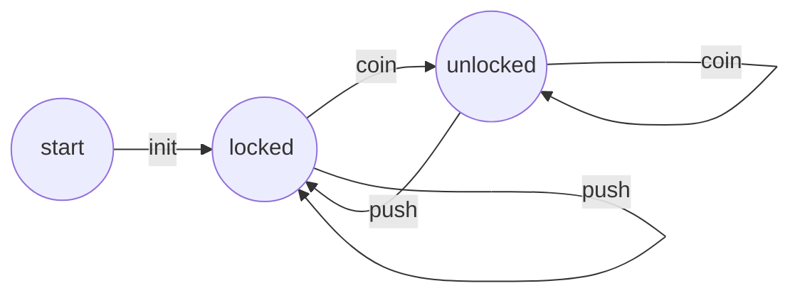

# Automations

Automations are how you program Sentants.  An Automation is a form of Finite State Machine.  Wikipedia has a [fairly good definition](https://en.wikipedia.org/wiki/Finite-state_machine) of finite state machines.

Automations contain Transitions, which in turn have Actions.  The example on wikipedia has a turnstile that is unlocked with a coin, that can then be pushed for entry, whereupon it returns to the locked state.



In Sentant definition notation, that would like this:

```yaml
automations:
  - name: Turnstile
    description: A turnstile example
    transitions:
      - from: start
        event: init
        to: locked
        
      - from: locked
        event: coin
        to: unlocked
        
      - from: unlocked
        event: push
        to: locked
        
      - from: locked
        event: push
        to: locked
        
      - from: unlocked
        event: coin
        to: unlocked
```

### The start state and init event

When an Automation is started for the first time (or restarted), the first state is `start`, and then immediately after, the `init` event is issued.  These can be used to ensure the Automation goes into a named state and perhaps even does some actions at the start.

In the above example that corresponds to the `start -> init ->  locked` state.

### Private and public events

As it stands, the Automation is not that useful because it cannot be accesed from outside.  Unless stated otherwise, events are private to the Sentant, so cannot be triggered by an event coming in via the GraphQL `SentantSend` mutation.  Let's modify the above so that we can accept events from an actual turnstile's electronic circuits.

```yaml
automations:
  - name: Turnstile
    description: A turnstile example
    transitions:
      - from: start
        event: init
        to: locked
        
      - from: locked
        public: true
        event: coin
        to: unlocked
        
      - from: unlocked
        public: true
        event: push
        to: locked
```

OK, that's great - now we can imagine that the physical turnstile has a switch that is triggered when a coin is put in, and when the turnstile is pushed.  However, we also want to control the actions of the turnstile as to whether it should be able to be pushed or not - ie whether it is locked (with no coin) or unlocked (after a coin has been put in).  We do that with signals.

Note also that we have removed the `locked -> locked` and `unlocked -> unlocked` transitions as nothing changes, so they are redundant (unless there are some additional actions to perform in these cases - see later)

### Signals

```yaml
automations:
  - name: Turnstile
    description: A turnstile example
    transitions:
      - from: start
        event: init
        to: locked
        actions:
          - command: signal
            parameters:
              public: true
              event: lock
        
      - from: locked
        public: true
        event: coin
        to: unlocked
        actions:
          - command: signal
            parameters:
              public: true
              event: unlock
        
      - from: unlocked
        public: true
        event: push
        to: locked
        actions:
          - command: signal
            parameters:
              public: true
              event: lock
```

In the example above, when a coin is put in, the state goes to unlocked, and a signal is sent to the turnstile electronics to unlock the gate.  Similarly, when a push event is received from the turnstile, the state becomes locked, and we send a signal to the turnstile electronics to lock the gate.

To listen for signals, you use the `awaitSignal` GraphQL subscription.

The signals are examples of actions - these are further detailed below.

The `public` boolean is used to denote that the signal can be subscribed to by anyone, not just the Sentant owner.

### Future events

Events can be sent to occur after a set period of time.  For example, maybe the turnstile only remains unlocked for one minute after a coin is put in, whereupon it locks again, even if no-one has gone through.  To do that, you can send an event after a delay, for example:

```yaml
automations:
  - name: Turnstile
    description: A turnstile example
    transitions:
      - from: start
        event: init
        to: locked
        actions:
          - command: signal
            parameters:
              public: true
              event: lock
        
      - from: locked
        public: true
        event: coin
        to: unlocked
        actions:
          - command: signal
            parameters:
              public: true
              event: unlock
              
          - command: send
            parameters:
              event: lock
              delay: 60000
        
      - from: unlocked
        public: true
        event: push
        to: locked
        actions:
          - command: signal
            parameters:
              public: true
              event: lock
              
      - from: "*"
        event: lock
        to: locked
        actions:
          - command: signal
            parameters:
              public: true
              event: lock
```

Now, you can see that an additional action occurs when a coin unlocks the turnstile, that sends the event `lock` after a delay of 60000 milliseconds.

Any future events already waiting with the same name are overwritten by the current one, so you don't get multiple events triggering for the same action in the future.  For the turnstile, this would mean that every time someone puts in a coin the timer restarts for when the gate will lock again.

### Wildcard events

In the above example, there is also a new transition, that has the `from` state as `*` meaning 'any state' that locks the gate and sends a signal.  In this instance, we are saying 'regardless of whether the turnstile is locked or not, lock it'.   This is called a wildcard.

You can also have a `to` state of `*` which means 'don't change state'.  Sometimes, Sentants might be set up where it is the actions that occur in response to events that are important rather than the state itself.  In that case, `from` and `to` states of `*` mean we can essentially ignore the state.

If you omit the `to` or `from` states, they are assumed to be wildcards, as in the following:

```json
{
    "event": "Broadcast to nearby", 
    "public": true, 
    "parameters": {"radius": "number", "message": "string"}, 
    "actions": 
    [
        {"command": "search",   "plugin": "ai.reality2.geospatial"},
        {"command": "set",      "parameters": {"key": "to", "value": {"jsonpath": "sentants.[].id"}}},
        {"command": "send",     "parameters": {"event": "hello"}}
    ]
}
```

The example above uses the radius and message parameters sent in from the `sentantSend` to 'broadcast' a `message` to Sentants nearby, within a certain `radius`.

1. Search for Sentants within that `radius`,
2. Set the `to` parameter required by the send command to an array of ids returned by the search.
3. Send the `message` with a `hello` event, which can be received in another transition:

```json
{
    "event": "hello",
    "actions": [
        {"command": "signal", "parameters": {"event": "hello", "public": true}}
    ]
}
```

4. The event `hello` triggers an action that sends a signal with whatever is in the parameters at the time, which will include the message that was sent in from the original `sentantSend`.

