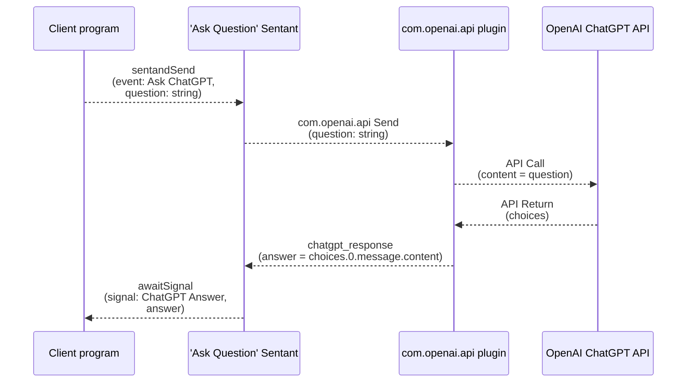

# OpenAI (ChatGPT) plugin

### Description

A (simple) plugin definition for ChatGPT.  ChatGPT has a wide and complex API, this example only uses the [Text Generation](https://platform.openai.com/docs/guides/text-generation) section, however, there is much more that could be done.  The dataflow to ask a question and get an answer is:



The basic set up to use gpt3.5, for example, is as follows (this is from the chatgpt_question example in the python folder):

```yaml
  plugins:
    - name: com.openai.api # This is the name of the plugin, used in the Automation below
      url: https://api.openai.com/v1/chat/completions # This is the URL to the API endpoint
      method: POST # This is the HTTP method to use

      # These are the headers to send (see ChatGPT API documentation)
      headers:
        "Content-Type": "application/json"
        # This is a secret, so it is not shown here (replace before passing to Reality2)
        "Authorization": "Bearer __openai_api_key__"

      # This is the body to send (see ChatGPT API documentation).  Note the __message__ placeholder.
      body:
        model: "gpt-3.5-turbo-1106"
        messages:
          - role: "system"
            content: "You are a helpful assistant."
          - role: "user"
            content: __question__

      # How to process the output from the API.  The value is a simplified JSON path expression.
      output:
        key: answer
        value: "choices.0.message.content"
        event: chatgpt_response
```

To further understand the capabilities and potential of the OpenAI API, have a look [here](https://platform.openai.com/docs/introduction).

### Usage

To use the plugin, you need to set up an Automation like this:

```yaml
  automations:
    - name: ChatGPT # This is the name of the automation.
      description: This is a test automation. # This is the description of the automation.
      transitions: # This is a list of transitions, so begin with a dash.

          # Send a message (question) to ChatGPT, initiated from an event.
          event: "Ask ChatGPT"
          parameters: 
            question: string
          public: true
          to: ready
          actions:
            - plugin: com.openai.api
              command: send

          # Get the answer from ChatGPT and send out as a signal.
          event: chatgpt_response
          to: ready
          actions:
            - command: signal # sends a signal to subscribed clients
              parameters:
                public: true
                event: "ChatGPT Answer"
```

Note that you have to replace the `__openai_api_key__` in the plugin definition with your own ChatGPT API Key.