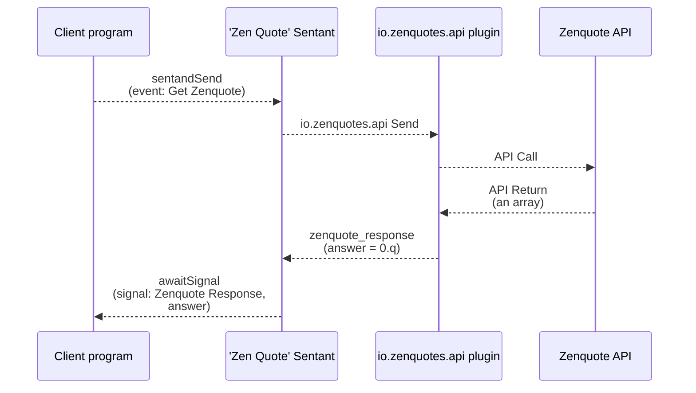

# Zenquote plugin

### Description

Zenquotes is a fun place to get your daily quote.  Go to [https://zenquotes.io](https://zenquotes.io/) to read more.  What's even better is that they have an API.  Here, we are using the random quote API (this example is in the python folder).  The data flow is:



The plugin definition is:

```yaml
  plugins:
    - name: io.zenquotes.api
      url: https://zenquotes.io/api/random
      method: GET
      headers:
        "Content-Type": "application/json"        
      output:
        key: answer
        value: "0"
        event: zenquote_response
```

The value of the output is implied to be a JSONpath, so above, this is the first element of the array of data returned.  If there is no match, the last matching part of the path is returned, therefore, if there was no first element of the array, then the whole (in this case empty) array would be returned instead.

### Usage

To use the plugin, you can set up an Automation like this:

```yaml
  automations:
    - name: Zen Quote
      description: Get quote
      transitions:
        - public: true
          event: "Get Zenquote"
          actions:
            - plugin: io.zenquotes.api
              command: send
        - event: zenquote_response
          actions:
            - command: set
              parameters:
                key: quote
                value:
                  jsonpath: "answer.q"
            - command: set
              parameters:
                key: author
                value:
                  jsonpath: "answer.a"
            - command: set
              parameters: 
                key: answer
            - command: signal
              parameters:
                public: true
                event: "Zenquote Response"
```

Something to notice here is the use of the `set` commands to further extract the desired content from the returned answer using `jsonpath`.

The variable `quote` will be set to the quote string, and the variable `author` will be set to the name of the author of the quote.  Then, the `answer` which came from the plugin is set to null and removed so as not to clutter up the final output.