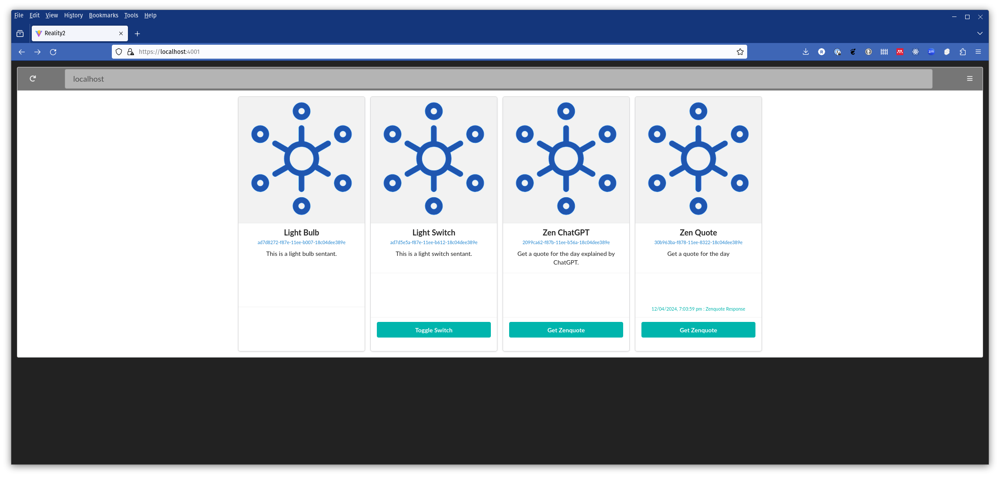
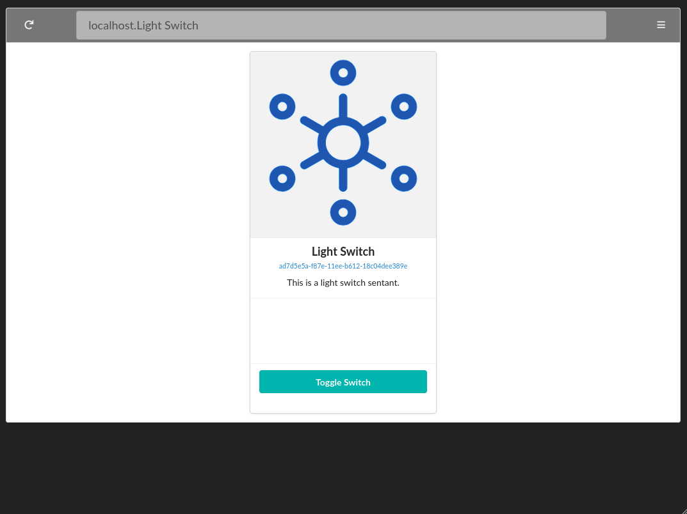

# Example

This example uses [Svelte](https://svelte.dev/) and the [Svelte Fomantic UI.](https://github.com/roycdaviesuoa/svelte-fomantic-ui).  It was set up using vite.  See the section on 'Adding a WebApp' for more information.

You can get all the Sentants on a node in a browser with:

```text
https://localhost:4005
```



or a specific Sentant with either its ID or Name in the query:

```text
https://localhost:4005/?name=Light Switch
https://localhost:4005/?id=ad7d5e5a-f87e-11ee-b612-18c04dee389e
```




This is the main `App.svelte` for the Reality2 Node.  See the web/sentants folder for more files and details.

```svelte
<!------------------------------------------------------------------------------------------------------
  Simple WebApp for a Reality Node

  Author: Dr. Roy C. Davies
  Created: April 2024
  Contact: roy.c.davies@ieee.org
------------------------------------------------------------------------------------------------------->
<script lang="ts">
    import { behavior, Cards, Menu, Link, Icon, Segment, Button, Item, Message, Header, Text, Input } from "svelte-fomantic-ui";

    import R2 from "./lib/reality2";
    import type Sentant from './lib/reality2';
    import SentantCard from './lib/SentantCard.svelte';
   
    import { getQueryStringVal } from './lib/Querystring.svelte';

    import { onMount } from 'svelte';


    // -------------------------------------------------------------------------------------------------
    // Window width
    // -------------------------------------------------------------------------------------------------
    let windowWidth: number = 0;

    const setDimensions = () => { windowWidth = window.innerWidth; };

    onMount(() => {
        setDimensions();
        window.addEventListener('resize', setDimensions);
        return () => { window.removeEventListener('resize', setDimensions); }
    });
    // -------------------------------------------------------------------------------------------------


    // -------------------------------------------------------------------------------------------------
    // Query Strings
    // -------------------------------------------------------------------------------------------------
    $: name_query = getQueryStringVal("name");
    $: id_query = getQueryStringVal("id");
    // -------------------------------------------------------------------------------------------------


    // -------------------------------------------------------------------------------------------------
    // The Path of this page
    // -------------------------------------------------------------------------------------------------
    $: path = window.location.hostname + (name_query ? "." + name_query : "") + (id_query ? "." + id_query : "");
    // -------------------------------------------------------------------------------------------------


    // -------------------------------------------------------------------------------------------------
    // Main functionality
    // -------------------------------------------------------------------------------------------------
    // GraphQL client setup 
    let r2_node = new R2(window.location.hostname, 4005, true);

    // Set up the monitoring of the Reality2 Node
    setTimeout(() => { r2_node.monitor((_data: any) => { sentantData = loadSentants(); }); }, 1000);

    // Get all the sentants, or a single Sentant if there is a name or id in the query string
    $: sentantData = loadSentants();

    function loadSentants() {
        if (id_query != null) {
            return r2_node.sentantGet(id_query, "name id description events { event parameters } signals")
        }
        else if (name_query != null) {
            return r2_node.sentantGetByName(name_query, "name id description events { event parameters } signals");
        }
        else {
            return r2_node.sentantAll("name id description events { event parameters } signals");
        }
    }
    // -------------------------------------------------------------------------------------------------


    // -------------------------------------------------------------------------------------------------
    // Functions used in the Layout
    // -------------------------------------------------------------------------------------------------

    // Send an event to a Sentant
    function sentantSend(e: CustomEvent) { r2_node.sentantSend(e.detail.id, e.detail.event, e.detail.params); }

    // Await a signal from a Sentant
    function awaitSignal(e: CustomEvent) { r2_node.awaitSignal(e.detail.id, e.detail.signal, e.detail.callback); }

    // return true if there are no Sentants, or only the one called "monitor"
    function none_or_monitor_only(data: {}) {
        let response = true;
        let sentants: Sentant[] = R2.JSONPath(data, "sentantAll");
        if (sentants == null) {
            let name = R2.JSONPath(data, "sentantGet.name");
            if (name !== "monitor")
                response = false;
        } else {
            for (let i = 0; i < sentants.length; i++) {
                if (R2.JSONPath(sentants[i], "name") !== "monitor") {
                    response = false;
                    break;
                }
            }
        }
        return response;
    }

    // Reload the page
    function reload() { sentantData = loadSentants(); }
    // -------------------------------------------------------------------------------------------------
</script>
<!----------------------------------------------------------------------------------------------------->


<!------------------------------------------------------------------------------------------------------
Layout
------------------------------------------------------------------------------------------------------->
<main>
    {#await sentantData}
        <p>Loading...</p>
    {:then response}
        <Menu ui top attached grey inverted borderless>
            <Item>
                <Button ui icon grey on:click={reload}>
                    <Icon redo/>
                </Button>
            </Item>
            <Item style={"margin: auto; width:"+(windowWidth-220)+"px;"}>
                <Input ui big disabled style={"width:100%;"}>
                    <Input text placeholder="Enter Path..." bind:value={path}/>
                </Input>
            </Item>
            <Menu right>
                <Link item on:click={() => behavior('sidebar', 'toggle')}>
                    <Icon sidebar/>
                </Link>
            </Menu>
        </Menu>
        <Segment ui bottom attached grey>
            {#if response.hasOwnProperty('errors')}
                <Message ui negative large>
                    <Header>
                        <Icon warning/>
                        Error
                    </Header>
                    <Text ui large>Incorrect {R2.JSONPath(response, "errors.0.message")}</Text>
                </Message>
            {:else if none_or_monitor_only(response.data)}
                <Message ui teal large>
                    <Header>
                        <Icon warning/>
                        No Sentants Found
                    </Header>
                </Message>
            {:else}
                <Cards ui centered>
                    {#if (id_query !== null)}
                        <SentantCard sentant={R2.JSONPath(response, "data.sentantGet")} on:sentantSend={sentantSend} on:awaitSignal={awaitSignal}/>
                    {:else if (name_query !== null)}
                        <SentantCard sentant={R2.JSONPath(response, "data.sentantGet")} on:sentantSend={sentantSend} on:awaitSignal={awaitSignal}/>
                    {:else}
                        {#each R2.JSONPath(response, "data.sentantAll") as sentant}
                            <SentantCard {sentant} on:sentantSend={sentantSend} on:awaitSignal={awaitSignal}/>
                        {/each}
                    {/if}
                </Cards>
            {/if}
        </Segment>
    {:catch error}
        <p>Error: {error.message}</p>
    {/await}
</main>
<!----------------------------------------------------------------------------------------------------->
```