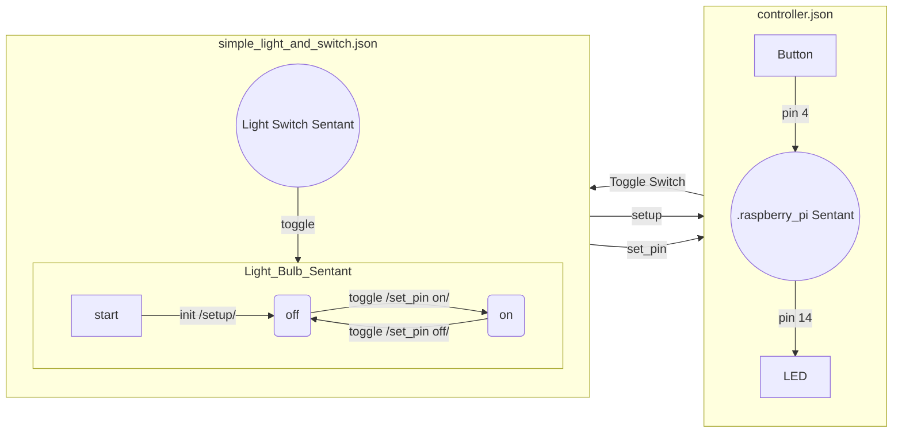
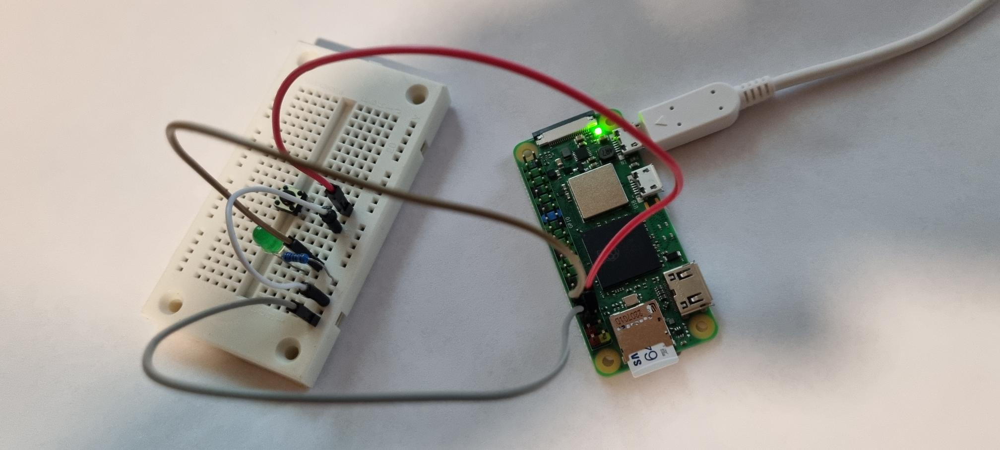

# Raspberry PI

The Raspberry PI is a well known brand of Single Board Computer (SBC).  This page details an example of how to control something from a Sentant using a Raspberry PI.

This example can be found in the python/rasppi folder.

To get started, import the gpiozero python library, ie:

```bash
pip3 install gpiozero
```

### Turning on and off a LED

One of the simplest cirtuits to set up is to turn an LED on and off.  Here is a [good example](https://www.circuitbasics.com/how-to-control-led-using-raspberry-pi-and-python/).  Set up the cirtuitry as per the example, then follow the instructions below.

There are various ways this can be done.  In this example, we set up a Sentant that will have the role of communicating with some Python code to control the Raspberry PI input and output pins.  The Python code (start.py) connects to the Sentant by graphql subscription and performs the hardware actions.

**NOTE:** This might seem a bit over-the-top just to turn a light on and off using a switch.  This is just a simple example, however, and using Sentants allows us to program complex behaviours more easily, whilst automatically connecting the Reality2 Node (aka the Raspberry PI SBC) to a web view, and other Reality2 Nodes as appropriate.

#### State and Sentant Diagram



#### Process

1. Start the Reality2 Node

   ```bash
   cd scripts
   ./run_as_dev
   ```


2. In another terminal window, start the Raspberry PI Controller Sentant

   ```bash
   cd python/rasppi
   python3 start.py
   ```


3. In a third terminal window, start the Light Switch and Bulb Sentants

   ```bash
   cd python
   python3 simple_light_and_switch.py
   ```

   


When the physical Button it pressed, that activates pin 4, which has been set to send a 'Toggle Switch' event to the 'Light Switch' Sentant via the '.raspberry_pi' Sentant.  This in turn toggles the 'Light Bulb' sentant between on and off states.

As the Light Bulb sentant switches on or off, it sends a 'set_pin' event to the '.raspberry_pi' Sentant, which sets pin 14 on or off accordingly.

#### Web View


#### Hardware



#### controller.json

```json
{
    "sentant": {
        "name": ".raspberry_pi",
        "description": "A Raspberry PI controlling Sentant, to be used by the Raspberry PI Control Script.",
        "automations": [
            {
                "name": "Raspberry PI Controller",
                "transitions": [
                    { "from": "start", "to": "ready", "event": "init" },
                    { "event": "setup", "public": true, "parameters": {"pin": "number", "type": "string"}, "actions": [
                        { "command": "signal", "parameters": {"public": true, "event": "setup"}}
                    ]},
                    { "event" : "set_pin", "public": true, "parameters": {"pin": "number", "state": "string"}, "actions": [
                        { "command": "signal", "parameters": {"public": true, "event": "set_pin"}}
                    ]}
                ]
            }
        ]
    }
}
```

This has two Transitions with actions, namely:

- `setup (pin: number, type: string, name: string, send: string)`

  - Send this event before using the pins.  Type can be 'LED' or 'Button' at present.  See the [gpiozero](https://gpiozero.readthedocs.io/en/latest/) documentation fore more information.  Name is the name of a Sentant to send the 'send' event to when type is 'Button' and a Button is then pressed.

- `set_pin (pin: number, state: string)`

  - Send this event when you want to set a pin to a particular state - for LEDs, either 'on' or 'off'.


#### start.py

```python
# ----------------------------------------------------------------------------------------------------
# Import the Reality2 module and other modules
# ----------------------------------------------------------------------------------------------------
from reality2 import Reality2 as R2
import json
import sys
from gpiozero import LED, Button
# ----------------------------------------------------------------------------------------------------


# ----------------------------------------------------------------------------------------------------
# Global variables
# ----------------------------------------------------------------------------------------------------
pins = {}             # Pin storage
r2_node = None        # Reality2 Node
id = ""               # ID of the .raspberry_pi Sentant.
# ----------------------------------------------------------------------------------------------------


# ----------------------------------------------------------------------------------------------------
# Do Stuff
# ----------------------------------------------------------------------------------------------------
def dostuff(data):
    global pins, r2_node
    
    # Get the event from the awaitSignal
    event = R2.JSONPath(data, "awaitSignal.event")

    # Get the parameters from the awaitSignal
    parameters = R2.JSONPath(data, "awaitSignal.parameters")

    # Get the pin number
    pin = R2.JSONPath(parameters, "pin")

    if (pin != None):
        # Decide what to do
        if (event == "setup"):
            # Setting up
            type = R2.JSONPath(parameters, "type")

            if (type != None):
                if type.lower() == "led":
                    # Set to LED
                    pins[str(pin)] = LED(pin)

                    print("Pin: " + str(pin) + " is set to output.")
                elif type.lower() == "button":
                    # Set to Button
                    pins[str(pin)] = Button(pin)

                    send = R2.JSONPath(parameters, "send")
                    ev_name = R2.JSONPath(parameters, "name")
                    pins[str(pin)].when_pressed = lambda: r2_node.sentantSendByName(ev_name, send)

                    print("Pin: " + str(pin) + " is set to input.")
                else:
                    print("Unknown type: " + type)

        elif (event == "set_pin"):
            # Setting an output pin
            state = R2.JSONPath(parameters, "state")
            print("Setting pin: " + str(pin) + " to state: " + str(state))
            
            if state == "on":
                pins[str(pin)].on()     # Turn on the LED
            else:
                pins[str(pin)].off()    # Turn off the LED
        else:
            print("Data : " + json.dumps(R2.JSONPath(data, "awaitSignal")))
    else:
        print("Data : " + json.dumps(R2.JSONPath(data, "awaitSignal")))
# ----------------------------------------------------------------------------------------------------

        


# ----------------------------------------------------------------------------------------------------
# Main function
# ----------------------------------------------------------------------------------------------------
def main(host):
    global r2_node, id

    # Connect to the Reality2 node
    r2_node = R2(host, 4001)
    
    # Unload the Sentant if it exists
    r2_node.sentantUnloadByName(".raspberry_pi")

    # Read the file
    with open('controller.json', 'r') as file:
        definition = file.read()
        
    # Load the Sentant
    result = r2_node.sentantLoad(definition)

    # Get the resulting ID
    id = R2.JSONPath(result, "sentantLoad.id")

    if (id != None):
        # Start the subscriptions to the Sentant
        r2_node.awaitSignal(id, "setup", dostuff)
        r2_node.awaitSignal(id, "set_pin", dostuff)

        print("+---- Light Bulb Controller for Raspberry PI -------------+")
        print("| Press q, followed by the enter key to quit.             |")
        print("+---------------------------------------------------------+")
        while (True):
            input_str = input()
            if (input_str == "q"):
                break
    else:
        print("Failed to load the Sentants.")

    # Close the subscriptions
    print("Closing the subscriptions and quitting.")
    r2_node.close()
# ----------------------------------------------------------------------------------------------------
    


# ----------------------------------------------------------------------------------------------------
if (__name__ == '__main__'):
    main(sys.argv[1] if (len(sys.argv) > 1) else "localhost")
# ----------------------------------------------------------------------------------------------------
```

Once this is in place, the Light Bulb and Light Switch Sentants can be loaded.  Note in particular the additional actions in the Light Bulb Sentant that sends events to the `.raspberry_pi` sentant, which in turn communicates with the GPIO.

Doing it this way allows multiple Sentants to communicate with the GPIO pins on the Raspberry PI.

**simple_light_and_switch.json**

```json
{
    "swarm": {
      "name": "Light and Switch",
      "description": "A Swarm of Sentants to illustrate sending events between Sentants.",
      "sentants": [
        {
          "name": "Light Switch",
          "automations": [
            {
              "name": "switch",
              "transitions": [
                {
                  "public": true,
                  "event": "Toggle Switch",
                  "actions": [
                    { "command": "send", "parameters": { "to": "Light Bulb", "event": "toggle" } }
                  ]
                }
              ]
            }
          ]
        },
        {
          "name": "Light Bulb",
          "automations": [
            {
              "name": "bulb",
              "transitions": [
                { "from": "start", "event": "init", "to": "off",
                  "actions": [
                    { "command": "send", "parameters": { "to": ".raspberry_pi", "event": "setup", "parameters": { "pin": 14, "type": "LED" } } },
                    { "command": "send", "parameters": { "to": ".raspberry_pi", "event": "setup", "parameters": { "pin": 4, "type": "Button", "send": "Toggle Switch", "name": "Light Switch" } } }
                  ]
                },
                {
                  "from": "off", "event": "toggle", "to": "on",
                  "actions": [
                    { "command": "send", "parameters": { "to": ".raspberry_pi", "event": "set_pin", "parameters": { "pin": 14, "state": "on" } } },
                    { "command": "signal", "public": true, "parameters": { "event": "Light on" } }
                  ]
                },
                {
                  "from": "on", "event": "toggle", "to": "off",
                  "actions": [
                    { "command": "send", "parameters": { "to": ".raspberry_pi", "event": "set_pin", "parameters": { "pin": 14, "state": "off" } } },
                    { "command": "signal", "public": true, "parameters": { "event": "Light off" } }
                  ]
                }
              ]
            }
          ]
        }
      ]
    }
}
```


